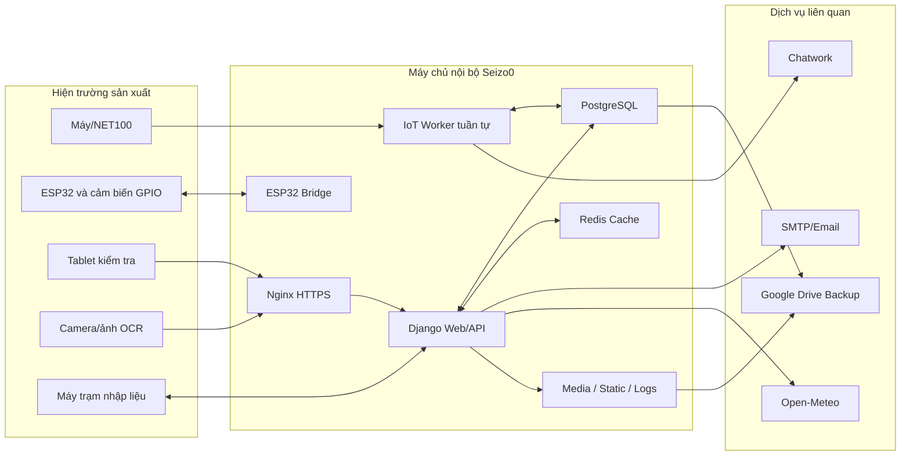
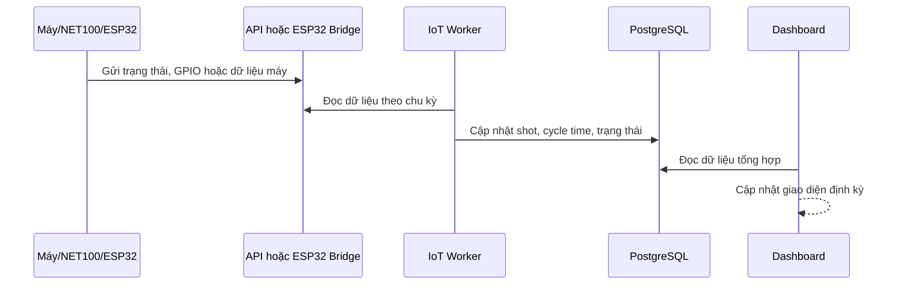
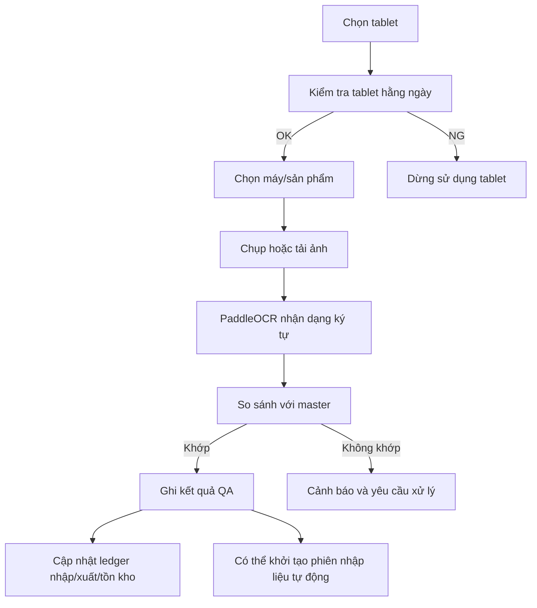
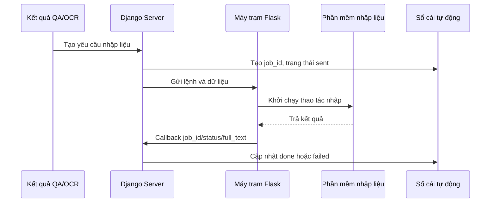

# BÁO CÁO TỔNG HỢP HỆ THỐNG CHUYỂN ĐỔI SỐ
## Công ty Hayashi Techno

**Tên hệ thống:** Seizo0 – Nền tảng quản lý sản xuất và nghiệp vụ nội bộ
**Ngày lập báo cáo:** 19/06/2026
**Múi giờ vận hành:** Asia/Tokyo
**Phạm vi:** Kiến trúc kỹ thuật, chức năng nghiệp vụ, cải tiến DX, vận hành, rủi ro và lộ trình phát triển
**Trạng thái:** Hệ thống đang vận hành nội bộ trên máy chủ tại công ty

---

## 1. Tóm tắt điều hành

Seizo0 là nền tảng web nội bộ được phát triển nhằm số hóa đồng bộ nhiều hoạt động tại Hayashi Techno, bao gồm:

- Giám sát trạng thái máy ép nhựa, sản lượng, cycle time và alarm theo thời gian gần thực.
- Thu thập dữ liệu từ thiết bị NET100, ESP32 và các nguồn dữ liệu trong nhà máy.
- Quản lý OCR, ảnh kiểm tra, xuất kho, nhập kho và tồn kho nguyên liệu.
- Tự động truyền dữ liệu từ kết quả OCR sang chương trình nhập liệu tại máy trạm.
- Quản lý thiết bị, khuôn, linh kiện thay thế và lịch sử nhập/xuất/điều chỉnh kho.
- Quản lý bảo trì, checklist chất lượng, đào tạo, chứng chỉ và quy trình phê duyệt.
- Quản lý suất ăn, FAX, tin tức và thông tin nội bộ.
- Sao lưu dữ liệu vận hành, phục hồi sự cố và triển khai bằng Docker.

Hệ thống không chỉ là một website quản lý đơn lẻ mà đang đóng vai trò như một nền tảng DX tích hợp giữa:

1. Thiết bị tại hiện trường.
2. Dữ liệu sản xuất.
3. Nghiệp vụ quản lý.
4. Nhân viên vận hành.
5. Hồ sơ phục vụ truy xuất và audit.

Tại thời điểm lập báo cáo, hệ thống có các chỉ số kỹ thuật đáng chú ý:

| Chỉ số | Giá trị hiện tại |
|---|---:|
| Phân hệ nghiệp vụ chính | Khoảng 12 |
| Model dữ liệu khai báo trong mã nguồn | 76 |
| Model nghiệp vụ được đăng ký tại runtime | 74 |
| URL/view route được khai báo | Khoảng 282 |
| Migration lịch sử | Khoảng 204 |
| Tài khoản người dùng | 84 |
| Máy sản xuất được quản lý | 27 |
| Thiết bị/khuôn/linh kiện trong `setsubi_zaiko` | 113 |
| Kết quả QA/OCR đã lưu | 2.573 |
| Hồ sơ phê duyệt | 186 |
| Khóa đào tạo | 13 |
| Cơ sở dữ liệu runtime | PostgreSQL |
| Hạ tầng runtime | Docker Compose |

Các số liệu trên là ảnh chụp hệ thống ngày 19/06/2026 và có thể tiếp tục thay đổi trong quá trình vận hành.

---

## 2. Bối cảnh và mục tiêu của dự án

### 2.1. Bối cảnh

Trong môi trường sản xuất, dữ liệu thường bị phân tán giữa máy móc, giấy tờ, file Excel, email, ảnh chụp, phần mềm tại máy trạm và kinh nghiệm cá nhân. Điều này tạo ra các vấn đề:

- Khó quan sát trạng thái toàn nhà máy tại một nơi.
- Mất thời gian tổng hợp sản lượng và alarm.
- Dễ nhập sai dữ liệu khi thao tác lặp lại bằng tay.
- Khó truy xuất ai đã nhập, xuất, sửa hoặc xác nhận dữ liệu.
- Hồ sơ thiết bị, khuôn và linh kiện không liên kết chặt với nhau.
- Dữ liệu kiểm tra chất lượng và hình ảnh nằm rời rạc.
- Khi đổi máy chủ hoặc xảy ra lỗi cơ sở dữ liệu, thời gian phục hồi kéo dài.
- Các quy trình nội bộ như đào tạo, phê duyệt, bảo trì và suất ăn phụ thuộc nhiều vào giấy hoặc trao đổi thủ công.

### 2.2. Mục tiêu tổng thể

Dự án Seizo0 hướng đến các mục tiêu:

- Tập trung dữ liệu nghiệp vụ về một nền tảng chung.
- Thu thập dữ liệu hiện trường tự động hơn.
- Giảm thao tác nhập liệu lặp lại.
- Tăng khả năng truy xuất và minh bạch dữ liệu.
- Cung cấp dashboard trực quan cho quản lý và hiện trường.
- Chuẩn hóa hồ sơ để hỗ trợ IATF và hoạt động audit.
- Giảm thời gian phản ứng khi có alarm, thiếu tồn kho hoặc sự cố.
- Tạo nền tảng có thể tiếp tục mở rộng theo từng bài toán DX của công ty.

---

## 3. Phạm vi hệ thống hiện tại

### 3.1. Nhóm sản xuất và IoT

- Dashboard trạng thái máy.
- Theo dõi production, stop, arrange, alarm và offline.
- Theo dõi shot count và cycle time.
- Đồng bộ kế hoạch sản xuất.
- Quản lý khuôn và tuổi thọ khuôn.
- Theo dõi linh kiện máy và lịch sử thay thế.
- Thu thập dữ liệu NET100.
- Thu thập dữ liệu ESP32.
- Thống kê alarm.
- Hiển thị thời tiết, thông báo và Chatwork trên dashboard.
- Điều khiển đèn cảnh báo thông qua ESP32.

### 3.2. Nhóm QA, OCR và nguyên liệu

- Chụp hoặc tải ảnh kiểm tra.
- OCR thông tin trên ảnh.
- So sánh dữ liệu đầu vào với master.
- Quản lý lịch sử kiểm tra.
- Quản lý tablet dùng tại hiện trường.
- Kiểm tra tablet hằng ngày trước khi sử dụng.
- Quản lý nhập kho, xuất kho và tồn kho nguyên liệu.
- Xuất dữ liệu CSV phục vụ báo cáo và audit.
- Liên kết kết quả quét ảnh với phiên nhập liệu tự động.

### 3.3. Nhóm thiết bị, khuôn và linh kiện

- Danh mục thiết bị.
- Danh mục khuôn.
- Danh mục linh kiện tồn kho.
- Cấu trúc catalog nhiều cấp.
- Liên kết thiết bị/khuôn với linh kiện sử dụng.
- Lịch sử nhập, xuất, trả lại, hủy và điều chỉnh.
- Ảnh thiết bị, ảnh linh kiện và ảnh nameplate.
- Liên kết thư mục tài liệu và bản vẽ.
- Trường dữ liệu phục vụ kiểm soát chất lượng và IATF.

### 3.4. Nhóm quản trị nội bộ

- Phê duyệt tài liệu.
- Tin tức nội bộ.
- Quản lý đào tạo và chứng chỉ.
- Quản lý bảo trì.
- Checksheet chất lượng.
- Quản lý suất ăn.
- Nhắc FAX tự động.
- Quản lý tài khoản và hồ sơ người dùng.

---

## 4. Kiến trúc tổng thể

### 4.1. Mô hình kiến trúc



### 4.2. Các thành phần hạ tầng

| Thành phần | Công nghệ | Vai trò |
|---|---|---|
| Reverse proxy | Nginx 1.27 Alpine | HTTPS, chuyển tiếp request, phục vụ static/media |
| Backend | Django 5.2 | Giao diện web, API, nghiệp vụ, xác thực |
| Database | PostgreSQL 16 | Cơ sở dữ liệu runtime chính |
| Cache | Redis 7 | Cache trạng thái và dữ liệu ngắn hạn |
| IoT bridge | Python `aiohttp` | Nhận HTTP/WebSocket từ ESP32 |
| OCR | PaddleOCR/PaddlePaddle | Nhận dạng ký tự từ ảnh |
| Worker | Django management commands | Thu thập và đồng bộ dữ liệu nền |
| Container | Docker Compose | Chuẩn hóa triển khai và phục hồi |
| Backup | `pg_dump`, PowerShell, rclone | Sao lưu DB và dữ liệu runtime |
| Frontend | Django Template, JavaScript, Bootstrap, Tailwind theo từng app | Giao diện tablet, desktop và dashboard |

### 4.3. Mô hình triển khai runtime

Các container chính đang hoạt động:

- `seizo0-django`: ứng dụng web Django.
- `seizo0-nginx`: reverse proxy HTTP/HTTPS.
- `seizo0-postgres`: cơ sở dữ liệu PostgreSQL, có health check.
- `seizo0-redis`: cache.
- `seizo0-esp32-bridge`: bridge HTTP/WebSocket trên cổng 9000.
- `iot-worker-serial`: worker IoT chạy tuần tự.
- `fax-reminder-daily`: tác vụ nhắc FAX hằng ngày.

### 4.4. Lý do sử dụng Docker

- Giảm khác biệt môi trường giữa phát triển và vận hành.
- Đóng gói dependency OCR phức tạp.
- Dễ khởi động lại từng dịch vụ.
- Dễ chuyển sang máy chủ mới.
- Tách database, web, cache, proxy và worker.
- Hỗ trợ chuẩn hóa quy trình backup/restore.

---

## 5. Phân hệ IoT và dashboard sản xuất

### 5.1. Chức năng

Phân hệ `iot` là trung tâm dữ liệu sản xuất, có nhiệm vụ:

- Quản lý danh sách máy và địa chỉ thiết bị.
- Hiển thị trạng thái máy theo thời gian gần thực.
- Thu thập shot count và cycle time.
- Hiển thị kế hoạch sản xuất theo máy.
- Theo dõi alarm đang hoạt động và lịch sử alarm.
- Quản lý khuôn, tuổi thọ khuôn và tổng shot.
- Quản lý linh kiện máy và lịch sử thay thế.
- Theo dõi ESP32, NET100 và thiết bị Arduino.
- Hiển thị KPI tổng hợp theo nhà máy.
- Đồng bộ thông báo Chatwork.
- Hiển thị thông tin 4M.

### 5.2. Các trạng thái máy

Hệ thống chuẩn hóa trạng thái máy về các nhóm:

- `production`: đang sản xuất.
- `stop`: dừng.
- `arrange`: chuẩn bị hoặc thay đổi điều kiện.
- `alarm`: có cảnh báo.
- `offline`: mất kết nối hoặc không có dữ liệu.

Việc chuẩn hóa giúp dữ liệu từ nhiều loại thiết bị khác nhau có thể hiển thị trên cùng một dashboard.

### 5.3. Dòng dữ liệu IoT



### 5.4. Worker tuần tự

Worker IoT được tổ chức chạy tuần tự nhằm:

- Tránh nhiều process cùng ghi dữ liệu trùng lặp.
- Hạn chế race condition.
- Dễ theo dõi lỗi theo từng command.
- Có kiểm tra sức khỏe database định kỳ.

Lịch hiện tại:

- Khoảng 30 giây:
  - Cập nhật machine counter.
  - Cập nhật mold shot.
  - Cập nhật ESP32 shot.
- Khoảng 180 giây:
  - Cập nhật NET100 shot.
  - Đồng bộ Chatwork.
- Khoảng 300 giây:
  - Kiểm tra kết nối và sức khỏe database.

### 5.5. ESP32 bridge

ESP32 bridge hỗ trợ:

- HTTP GET để đọc trạng thái thiết bị.
- HTTP POST để thiết bị cập nhật trạng thái.
- WebSocket để thiết bị gửi dữ liệu liên tục.
- Tương thích cả URL mới và firmware cũ.
- Lưu trạng thái cuối vào file để hỗ trợ khôi phục.

Thiết kế này giúp giảm phụ thuộc vào một phiên bản firmware duy nhất.

### 5.6. Đèn cảnh báo alarm

Dashboard xác định nhà máy có máy alarm và gửi lệnh điều khiển tới ESP32 đèn cảnh báo:

- Có alarm: gửi lệnh bật.
- Hết alarm: gửi lệnh tắt.
- Có thể phân biệt khu vực Factory 1, Factory 2 hoặc cả hai.

Luồng đã được kiểm tra về mặt kết nối và logic. Đây là ví dụ điển hình của việc chuyển dữ liệu dashboard thành hành động vật lý tại hiện trường.

### 5.7. Giá trị DX

- Quản lý có thể quan sát tình trạng máy tập trung.
- Giảm việc đi kiểm tra từng máy.
- Tăng tốc phản ứng khi có alarm.
- Có dữ liệu shot/cycle time để phân tích năng suất.
- Kết nối kế hoạch sản xuất với tình trạng thực tế.
- Tạo nền tảng để tính OEE và downtime chính xác hơn.

---

## 6. Phân hệ QA, OCR và quét ảnh

### 6.1. Mục tiêu

Phân hệ `quet_anh` hỗ trợ xác nhận nguyên liệu/sản phẩm bằng hình ảnh và OCR, giảm nguy cơ:

- Chọn sai nguyên liệu.
- Xuất nhầm sản phẩm.
- Nhập sai mã.
- Thiếu bằng chứng hình ảnh.
- Không xác định được người thao tác.

### 6.2. Quy trình cơ bản



### 6.3. Các cải tiến đã triển khai

- Ổn định phiên bản PaddleOCR và PaddlePaddle.
- Đóng gói model OCR vào Docker image.
- Tắt các tùy chọn native không ổn định như MKLDNN trong luồng cần thiết.
- Bổ sung log lỗi OCR thay vì trả kết quả 0% mà không có nguyên nhân.
- Cho phép cùng một mã máy có nhiều sản phẩm và yêu cầu chọn đúng sản phẩm.
- Thêm kiểm tra tablet hằng ngày trước khi dùng.
- Lưu thiết bị tablet đang sử dụng trong session.
- Hỗ trợ preset lỗi kiểm tra để thao tác nhanh.
- Bổ sung QR mẫu trong workflow kiểm tra.
- Lưu lịch sử ảnh và kết quả để truy xuất.

### 6.4. Quản lý nguyên liệu

Hệ thống quản lý:

- Material master.
- Nhập kho nguyên liệu.
- Xuất kho nguyên liệu.
- Tồn kho hiện tại.
- Điều chỉnh tồn kho.
- Người thao tác.
- Số phiếu hoặc thông tin liên quan.
- Xác nhận của quản lý.
- Xuất CSV.

Ledger được thiết kế theo hướng không chỉ lưu “số tồn hiện tại” mà còn lưu lịch sử biến động để có thể truy xuất.

### 6.5. Hỗ trợ IATF và audit

Các điểm hỗ trợ audit:

- Lưu người thao tác.
- Lưu thời gian.
- Lưu loại giao dịch.
- Lưu số lượng trước/sau điều chỉnh khi có.
- Lưu lý do điều chỉnh.
- Lưu xác nhận.
- Lưu hình ảnh liên quan.
- Xuất dữ liệu CSV.
- Hạn chế sửa trực tiếp không để lại dấu vết.

### 6.6. Giá trị DX

- Giảm lỗi nhập sai do thao tác thủ công.
- Tăng độ tin cậy của kiểm tra xuất/nhập kho.
- Có bằng chứng ảnh khi xảy ra vấn đề.
- Giảm thời gian tra cứu lịch sử.
- Hỗ trợ phân tích lỗi theo máy, sản phẩm, người thao tác hoặc thời gian.

---

## 7. Tự động hóa nhập liệu tại máy trạm

### 7.1. Vấn đề nghiệp vụ

Sau khi OCR hoặc xác nhận dữ liệu, nhân viên vẫn có thể phải mở phần mềm khác và nhập lại cùng một nội dung. Đây là thao tác:

- Tốn thời gian.
- Dễ nhập sai.
- Khó theo dõi trạng thái thành công/thất bại.
- Có thể tạo job trùng nếu thao tác nhiều lần.

### 7.2. Giải pháp đã triển khai

Phân hệ `nhap_lieu` kết nối Django với chương trình Flask tại máy trạm:

- Django tạo một phiên nhập liệu có `job_id`.
- Máy trạm nhận yêu cầu chạy chương trình.
- Máy trạm khóa job để tránh chạy chồng.
- Kết quả được callback về Django.
- Callback có cơ chế retry.
- Django theo dõi trạng thái `sent`, `done`, `failed`.
- Job quá thời gian được chuyển sang thất bại để tránh treo vô hạn.
- Kết quả được liên kết với bản ghi QA.
- Có sổ cái theo dõi job nhập liệu.
- Có API polling và SSE phục vụ cập nhật gần realtime.

### 7.3. Luồng kỹ thuật



### 7.4. Giá trị DX

- Loại bỏ nhập lại dữ liệu đã có.
- Giảm lỗi đánh máy.
- Theo dõi được từng job.
- Có thể đo tỷ lệ thành công tự động.
- Tạo tiền đề cho RPA nội bộ có kiểm soát.

---

## 8. Quản lý thiết bị, khuôn và linh kiện `setsubi_zaiko`

### 8.1. Mục tiêu

Phân hệ này được xây dựng để quản lý ba đối tượng khác nhau:

1. Thiết bị/máy móc.
2. Khuôn.
3. Linh kiện tồn kho.

Giao diện và logic đã được tách rõ để tránh cộng thiết bị hoặc khuôn vào số tồn kho linh kiện.

### 8.2. Chức năng chính

- Danh mục thiết bị.
- Danh mục khuôn.
- Danh mục linh kiện.
- Tìm kiếm theo mã, tên, maker, model, kệ và máy áp dụng.
- Upload ảnh linh kiện và ảnh nameplate.
- Liên kết URL nhà cung cấp.
- Quản lý mã thay thế.
- Quản lý đơn vị tồn kho.
- Quản lý tồn tối thiểu.
- Quản lý transaction ledger.
- Xuất danh mục và ledger ra CSV.

### 8.3. Cấu trúc catalog nhiều cấp

Hệ thống hỗ trợ cây catalog không giới hạn cố định số tầng, ví dụ:

```text
Khách hàng
└── Sản phẩm
    └── Khuôn
        └── Cụm chi tiết
            └── Linh kiện
```

Hoặc:

```text
Thiết bị
└── Nhóm thiết bị
    └── Nhà sản xuất
        └── Series/Model
            └── Mã quản lý
```

### 8.4. Liên kết tài liệu

- Thiết bị có thể liên kết thư mục tài liệu.
- Khuôn có thể liên kết thư mục bản vẽ.
- Có command đồng bộ dữ liệu từ cấu trúc folder.
- Có command import danh sách thiết bị từ Excel.

Điều này kết nối dữ liệu master trên hệ thống với tài liệu kỹ thuật đang lưu trên file server.

### 8.5. Ledger tồn kho

Các loại giao dịch hỗ trợ:

- `IN`: nhập kho.
- `OUT`: xuất kho.
- `ADJ+`: điều chỉnh tăng.
- `ADJ-`: điều chỉnh giảm.
- `RETURN`: trả lại.
- `SCRAP`: hủy.

Mỗi giao dịch có thể lưu:

- Linh kiện.
- Số lượng.
- Người thao tác.
- Thời gian.
- Lý do.
- Máy/khuôn liên quan.
- Chứng từ hoặc ghi chú.

### 8.6. Trường dữ liệu hướng IATF

- Quality rank.
- Control Plan No.
- Process owner.
- Calibration due date.
- Inventory check due date.
- Audit trail.
- Mức tồn an toàn.
- Thông tin maker/supplier.
- Vị trí kệ.

### 8.7. Giá trị DX

- Tìm linh kiện nhanh hơn.
- Giảm nguy cơ dùng sai linh kiện.
- Biết linh kiện đang áp dụng cho máy hoặc khuôn nào.
- Có lịch sử xuất/nhập rõ ràng.
- Có cảnh báo thiếu tồn kho.
- Hỗ trợ chuẩn bị hồ sơ audit.
- Giảm phụ thuộc vào trí nhớ cá nhân.

---

## 9. Quản lý bảo trì

Phân hệ `baotri` hỗ trợ:

- Tạo nhiệm vụ bảo trì.
- Tạo checklist chi tiết.
- Gán mã công việc.
- Bắt đầu và xác nhận công việc.
- Lưu kết quả thực hiện.
- Quản lý lỗi hoặc sai sót bảo trì.
- Dashboard bảo trì.
- Báo cáo shot liên quan bảo trì.
- Xuất CSV/PDF.

### Giá trị mang lại

- Chuẩn hóa công việc bảo trì.
- Giảm bỏ sót hạng mục.
- Có lịch sử xác nhận.
- Có cơ sở phân tích lỗi lặp lại.
- Có thể phát triển thành bảo trì dự phòng theo shot hoặc thời gian.

---

## 10. Quản lý checksheet chất lượng

Phân hệ `mente` hỗ trợ:

- Quản lý sản phẩm.
- Tạo và cập nhật checksheet.
- Quản lý người kiểm tra.
- Lưu lịch sử kiểm tra.
- Tra cứu theo sản phẩm.

### Giá trị mang lại

- Số hóa checksheet.
- Giảm thất lạc giấy.
- Dễ xem lịch sử.
- Chuẩn hóa nội dung kiểm tra.
- Tạo nguồn dữ liệu cho phân tích xu hướng chất lượng.

---

## 11. Quản lý đào tạo và năng lực

Phân hệ `learn` hỗ trợ:

- Danh sách khóa học.
- Đăng ký khóa học.
- Theo dõi khóa học của từng nhân viên.
- Đánh dấu hoàn thành.
- Quy trình phê duyệt báo cáo đào tạo.
- Báo cáo đào tạo.
- Quản lý chứng chỉ/bằng cấp.
- Quản lý nhà cung cấp đào tạo.
- Theo dõi access log.

### Giá trị mang lại

- Tập trung hồ sơ đào tạo.
- Biết nhân viên đã học và hoàn thành nội dung nào.
- Quản lý thời hạn và chứng chỉ.
- Hỗ trợ đánh giá năng lực.
- Hỗ trợ truy xuất hồ sơ khi audit.

---

## 12. Quy trình phê duyệt tài liệu

Phân hệ `phe_duyet` hỗ trợ:

- Tạo hồ sơ phê duyệt.
- Upload tài liệu.
- Phân loại tài liệu.
- Phê duyệt hoặc từ chối.
- Gửi thông báo từ chối.
- Upload bản đã phê duyệt.
- Bình luận và nhắn tin.
- Nhắc email.
- Xuất CSV/PDF.

### Giá trị mang lại

- Rút ngắn thời gian luân chuyển giấy.
- Xác định trạng thái hồ sơ.
- Lưu lịch sử quyết định.
- Dễ truy xuất tài liệu.
- Giảm nguy cơ dùng nhầm phiên bản chưa phê duyệt.

---

## 13. Quản lý suất ăn và FAX

Phân hệ `menu` hỗ trợ:

- Quản lý menu.
- Nhân viên đặt món.
- Quản lý lịch sử đặt.
- Quản lý ngày nghỉ.
- Tổng hợp đơn theo ngày.
- Xuất CSV, Excel và PDF.
- Theo dõi trạng thái FAX.
- Nhắc FAX tự động lúc 14:50.

### Giá trị mang lại

- Giảm tổng hợp thủ công.
- Hạn chế quên gửi FAX.
- Dễ chỉnh sửa và truy xuất đơn.
- Tiết kiệm thời gian hành chính hằng ngày.

---

## 14. Tin tức và truyền thông nội bộ

Phân hệ `news` hỗ trợ:

- Đăng tin nội bộ.
- Chỉnh sửa và xóa tin.
- Upload nhiều hình ảnh.
- Hiển thị tin trên trang chủ.

Dashboard IoT còn tích hợp:

- Ticker thông báo.
- Chatwork.
- Thông tin thời tiết Minami Minowa.
- Thông tin đặc biệt theo ngày.

Điều này giúp màn hình sản xuất trở thành một kênh truyền thông nội bộ, không chỉ là màn hình máy móc.

---

## 15. Các cải tiến kỹ thuật quan trọng đã thực hiện

### 15.1. Chuyển SQLite sang PostgreSQL

Nguyên nhân:

- SQLite từng bị lỗi `database disk image is malformed`.
- Nhiều worker ghi đồng thời làm tăng rủi ro hỏng dữ liệu.
- SQLite trên Windows bind mount không phù hợp với tải ghi liên tục.

Cải tiến:

- Chuyển database runtime sang PostgreSQL.
- Dùng Docker volume cho dữ liệu.
- Chuyển backup sang `pg_dump`.
- Giữ SQLite chỉ làm fallback/snapshot cũ.
- Bổ sung kiểm tra database health trong worker.

Kết quả:

- Tăng độ ổn định khi nhiều tác vụ cùng hoạt động.
- Giảm nguy cơ corruption.
- Hỗ trợ backup/restore chuyên nghiệp hơn.

### 15.2. Chuẩn hóa worker IoT

- Gom tác vụ IoT vào một worker tuần tự.
- Tắt các worker cũ chạy trùng.
- Tách command nhanh và command chậm.
- Ghi log thời gian chạy và lỗi.
- Kiểm tra database định kỳ.

### 15.3. Ổn định OCR

- Khóa version dependency phù hợp.
- Cài model OCR ngay trong quá trình build.
- Bổ sung script cài model.
- Giảm rủi ro segfault/native crash.
- Ghi log exception rõ ràng.
- Có test OCR với ảnh thực tế.

### 15.4. Audit route và API

Đã thực hiện quét 231 route/API trong một đợt audit:

- Phát hiện lỗi alarm API.
- Phát hiện lỗi reverse URL.
- Phát hiện lỗi form/import IoT.
- Phát hiện lỗi PDF menu.
- Phát hiện lỗi session nhân viên cũ trong Learn.
- Sau sửa không còn lỗi HTTP 500/exception trong phạm vi quét.

### 15.5. Backup và phục hồi

Backup runtime bao gồm:

- PostgreSQL dump.
- Source code.
- Media.
- Static files.
- Logs.
- Nginx config.
- `.env`.
- Các file deploy cần thiết.

Cơ chế upload:

- Ưu tiên rclone.
- Fallback sang Google Drive Desktop.
- Có quy tắc giữ số bản backup.
- Có tài liệu restore máy chủ mới.
- Có tài liệu xử lý sự cố database và Nginx 502.

### 15.6. HTTPS nội bộ

- Nginx phục vụ HTTPS.
- Hỗ trợ truy cập qua IP nội bộ.
- Có cấu hình certificate nội bộ.
- Static và media được phục vụ tách khỏi Django.

---

## 16. Giá trị cải tiến DX đối với Hayashi Techno

### 16.1. Đối với hiện trường sản xuất

- Quan sát máy nhanh hơn.
- Nhận biết alarm trực quan.
- Giảm thao tác ghi chép.
- Giảm nhập dữ liệu trùng.
- Dễ dùng trên tablet.
- Truy xuất ảnh và lịch sử thao tác.

### 16.2. Đối với quản lý

- Có dashboard tổng hợp.
- Có dữ liệu thay vì chỉ dựa vào báo cáo miệng.
- Có thể theo dõi kế hoạch và thực tế.
- Có cơ sở phân tích alarm, downtime, shot và cycle time.
- Có hồ sơ phê duyệt, đào tạo, bảo trì và tồn kho tập trung.

### 16.3. Đối với chất lượng

- Lưu ảnh bằng chứng.
- Chuẩn hóa checklist.
- Có audit trail.
- Dễ xuất dữ liệu.
- Giảm nguy cơ dùng sai nguyên liệu hoặc linh kiện.

### 16.4. Đối với bảo trì

- Liên kết máy, khuôn và linh kiện.
- Theo dõi lịch sử thay thế.
- Quản lý tuổi thọ khuôn theo shot.
- Hỗ trợ lập kế hoạch bảo trì dự phòng.

### 16.5. Đối với hành chính

- Số hóa phê duyệt.
- Số hóa đặt suất ăn.
- Nhắc FAX tự động.
- Quản lý đào tạo và chứng chỉ.
- Đăng tin nội bộ tập trung.

### 16.6. Đối với IT và vận hành hệ thống

- Có Docker deployment.
- Có PostgreSQL.
- Có backup runtime.
- Có tài liệu handoff và recovery.
- Có changelog.
- Có thể chuyển giao cho người vận hành khác.

---

## 17. Đánh giá mức độ trưởng thành DX

| Cấp độ | Mô tả | Trạng thái hiện tại |
|---|---|---|
| 1. Số hóa dữ liệu | Chuyển giấy/Excel rời rạc thành dữ liệu số | Đã triển khai trên nhiều nghiệp vụ |
| 2. Số hóa quy trình | Workflow nhập liệu, phê duyệt, QA, kho | Đã triển khai |
| 3. Tích hợp hệ thống | IoT, OCR, máy trạm, email, Chatwork | Đã triển khai một phần đáng kể |
| 4. Tự động hóa | Worker, callback, nhắc việc, cảnh báo | Đã triển khai |
| 5. Tối ưu bằng dữ liệu | KPI, dự báo, tối ưu bảo trì/chất lượng | Đang ở giai đoạn phát triển tiếp theo |

Nhìn chung, hệ thống đã vượt qua giai đoạn “chỉ nhập dữ liệu lên web” và đang ở giai đoạn tích hợp–tự động hóa. Bước tiếp theo nên tập trung vào chất lượng dữ liệu, KPI và khả năng ra quyết định.

---

## 18. Rủi ro và điểm cần cải thiện

### 18.1. Máy chủ đơn lẻ

Hiện hệ thống chạy trên laptop server nội bộ. Đây là điểm lỗi đơn:

- Hỏng ổ cứng.
- Mất điện.
- Windows/Docker lỗi.
- Máy chủ bị tắt hoặc cập nhật ngoài kế hoạch.

Khuyến nghị:

- Dùng UPS.
- Theo dõi dung lượng đĩa.
- Có máy dự phòng hoặc phương án restore đã diễn tập.
- Kiểm tra backup định kỳ bằng restore thử.

### 18.2. Bảo mật secret

Tài liệu kiến trúc ghi nhận từng có secret/SMTP password hardcode trong source.

Khuyến nghị:

- Chuyển toàn bộ secret sang `.env`.
- Đổi lại các mật khẩu đã từng xuất hiện trong source.
- Không đưa `.env` vào Git.
- Phân quyền truy cập file backup vì backup có thể chứa `.env`.

### 18.3. Django development server

Container web hiện dùng `python manage.py runserver`.

Khuyến nghị:

- Chuyển sang Gunicorn hoặc một WSGI server production.
- Cấu hình worker, timeout và graceful restart.
- Giữ Nginx làm reverse proxy.

### 18.4. Chứng chỉ HTTPS

Hệ thống dùng chứng chỉ nội bộ/self-signed.

Khuyến nghị:

- Xây dựng internal CA.
- Cài CA vào tablet, TV và PC công ty.
- Quản lý ngày hết hạn certificate.

### 18.5. Logging và monitoring

Hiện đã có log nhưng chưa có hệ thống giám sát tập trung.

Khuyến nghị:

- Health dashboard cho container, DB, disk và backup.
- Cảnh báo khi worker ngừng chạy.
- Cảnh báo khi ESP32 không gửi dữ liệu quá thời gian.
- Cảnh báo khi backup thất bại.
- Chuẩn hóa log JSON hoặc structured log.

### 18.6. Test tự động

Một số app đã có test tốt, nhưng độ bao phủ toàn hệ thống chưa đồng đều.

Khuyến nghị:

- Test route/reverse URL.
- Test permission.
- Test các workflow quan trọng.
- Test migration.
- Smoke test sau deploy.

### 18.7. Phân quyền

Hệ thống có nhiều nghiệp vụ nhạy cảm:

- Điều chỉnh tồn kho.
- Xóa lịch sử.
- Phê duyệt.
- Sửa shot.
- Quản lý tài khoản.

Khuyến nghị:

- Xây dựng ma trận role–permission.
- Ghi log mọi thao tác thay đổi dữ liệu quan trọng.
- Hạn chế chức năng xóa vật lý; ưu tiên soft delete khi phù hợp.

### 18.8. Dữ liệu master

Chất lượng dashboard phụ thuộc vào:

- Mã máy.
- Mã sản phẩm.
- Mã nguyên liệu.
- Tên khuôn.
- Mapping ESP32.
- Mapping kế hoạch.

Khuyến nghị:

- Quy định owner cho từng master.
- Có kiểm tra trùng.
- Có trạng thái active/inactive.
- Có lịch sử thay đổi master.

---

## 19. Đề xuất cải tiến giai đoạn tiếp theo

### 19.1. Ưu tiên 1: Ổn định nền tảng

Thời gian đề xuất: 1–2 tháng.

- Chuyển Django từ `runserver` sang Gunicorn.
- Hoàn tất quản lý secret bằng environment.
- Thêm health check cho web, worker và ESP32 bridge.
- Tự động kiểm tra backup hằng ngày.
- Thiết lập dashboard dung lượng đĩa.
- Bổ sung smoke test sau deploy.
- Chuẩn hóa quy trình release và rollback.

### 19.2. Ưu tiên 2: KPI sản xuất và OEE

Thời gian đề xuất: 2–4 tháng.

- Chuẩn hóa thời gian production, stop, alarm, arrange.
- Phân loại lý do dừng.
- Tính Availability, Performance và Quality.
- Dashboard OEE theo máy, ca, ngày và tháng.
- Pareto alarm.
- Top downtime.
- So sánh cycle time thực tế và tiêu chuẩn.

### 19.3. Ưu tiên 3: Bảo trì dự phòng

- Tạo ngưỡng bảo trì theo shot.
- Cảnh báo linh kiện sắp đến hạn thay.
- Liên kết alarm với lịch sử bảo trì.
- Tạo work order tự động.
- Theo dõi MTBF và MTTR.
- Đánh giá linh kiện gây dừng máy nhiều nhất.

### 19.4. Ưu tiên 4: Nâng cao quản lý kho

- QR/barcode cho linh kiện.
- Quét khi nhập/xuất.
- Kiểm kê bằng tablet.
- Reservation linh kiện cho kế hoạch bảo trì.
- Cảnh báo tồn dưới min và vượt max.
- Theo dõi lead time nhà cung cấp.
- Đề xuất mua hàng dựa trên tốc độ sử dụng.

### 19.5. Ưu tiên 5: Chất lượng và truy xuất

- Liên kết lot nguyên liệu → máy → khuôn → sản phẩm → kết quả QA.
- Truy xuất hai chiều từ thành phẩm về nguyên liệu.
- Dashboard lỗi theo lot.
- Cảnh báo lỗi lặp lại.
- Quản lý phiên bản tiêu chuẩn kiểm tra.
- Chữ ký điện tử cho bước xác nhận quan trọng.

### 19.6. Ưu tiên 6: Đào tạo và skill matrix

- Ma trận kỹ năng theo nhân viên và công đoạn.
- Cảnh báo chứng chỉ sắp hết hạn.
- Gợi ý khóa học còn thiếu.
- Không cho phân công công việc đặc biệt nếu chứng chỉ hết hạn.
- Dashboard tỷ lệ hoàn thành đào tạo.

### 19.7. Ưu tiên 7: BI và báo cáo quản trị

- Xây dựng data mart báo cáo.
- Dashboard theo ngày/tuần/tháng.
- Xuất báo cáo quản trị tự động.
- Gửi báo cáo tóm tắt qua email hoặc Chatwork.
- So sánh mục tiêu và thực tế.

---

## 20. KPI đề xuất để đo hiệu quả

Không nên chỉ đánh giá hệ thống bằng số lượng chức năng. Cần đo hiệu quả trước và sau cải tiến.

### 20.1. KPI sản xuất

| KPI | Công thức/ý nghĩa |
|---|---|
| Thời gian phản ứng alarm | Thời điểm bắt đầu xử lý − thời điểm alarm |
| Downtime theo máy | Tổng thời gian stop/alarm |
| Tỷ lệ đạt kế hoạch | Sản lượng thực tế / kế hoạch |
| Cycle time deviation | Cycle time thực tế − cycle time chuẩn |
| OEE | Availability × Performance × Quality |

### 20.2. KPI QA/OCR

| KPI | Công thức/ý nghĩa |
|---|---|
| Tỷ lệ OCR thành công | Job OCR thành công / tổng job |
| Tỷ lệ nhập liệu tự động thành công | Job `done` / tổng job |
| Tỷ lệ cần nhập lại | Job sửa tay / tổng job |
| Thời gian xử lý một lần kiểm tra | Kết thúc − bắt đầu |
| Số lỗi chọn sai nguyên liệu | Theo tháng |

### 20.3. KPI kho

| KPI | Công thức/ý nghĩa |
|---|---|
| Độ chính xác tồn kho | Số kiểm kê khớp / tổng số kiểm kê |
| Số lần thiếu linh kiện | Theo tháng |
| Thời gian tìm linh kiện | Từ lúc yêu cầu đến lúc lấy được |
| Tỷ lệ giao dịch có đầy đủ truy xuất | Giao dịch đủ người/thời gian/lý do / tổng giao dịch |
| Giá trị tồn chậm luân chuyển | Theo kỳ |

### 20.4. KPI bảo trì

| KPI | Công thức/ý nghĩa |
|---|---|
| MTBF | Thời gian vận hành / số lần hỏng |
| MTTR | Tổng thời gian sửa / số lần sửa |
| Tỷ lệ bảo trì đúng hạn | Công việc đúng hạn / tổng công việc |
| Tỷ lệ lỗi lặp lại | Lỗi lặp trong kỳ / tổng lỗi |

### 20.5. KPI hành chính

| KPI | Công thức/ý nghĩa |
|---|---|
| Thời gian phê duyệt | Hoàn thành − tạo hồ sơ |
| Tỷ lệ hồ sơ quá hạn | Hồ sơ quá hạn / tổng hồ sơ |
| Thời gian tổng hợp suất ăn | Trước và sau số hóa |
| Tỷ lệ hoàn thành đào tạo | Hoàn thành / kế hoạch |

---

## 21. Phương pháp tính lợi ích tài chính

Khi có dữ liệu đo thực tế, có thể quy đổi lợi ích:

### 21.1. Tiết kiệm thời gian

```text
Giờ tiết kiệm/tháng
= Số lần thao tác
× Thời gian tiết kiệm mỗi lần
÷ 60
```

```text
Giá trị tiết kiệm
= Giờ tiết kiệm
× Chi phí lao động trung bình/giờ
```

### 21.2. Giảm lỗi

```text
Giá trị tránh tổn thất
= Số lỗi giảm
× Chi phí trung bình mỗi lỗi
```

### 21.3. Giảm downtime

```text
Giá trị tăng sản lượng
= Số phút downtime giảm
× Sản lượng/phút
× Giá trị đóng góp mỗi sản phẩm
```

Các con số tài chính chỉ nên đưa vào báo cáo chính thức sau khi có dữ liệu baseline và xác nhận từ bộ phận liên quan.

---

## 22. Lộ trình đề xuất

### Giai đoạn 1 – Ổn định và chuẩn hóa

- Hoàn thiện bảo mật.
- Gunicorn.
- Monitoring.
- Backup verification.
- Permission matrix.
- Master data governance.

### Giai đoạn 2 – Đo lường

- Chuẩn hóa KPI.
- Thu thập downtime reason.
- Dashboard OEE.
- KPI OCR và nhập liệu tự động.
- KPI kho và bảo trì.

### Giai đoạn 3 – Tự động hóa nâng cao

- Work order bảo trì tự động.
- Cảnh báo tồn kho thông minh.
- Truy xuất lot hoàn chỉnh.
- Skill matrix.
- Báo cáo tự động.

### Giai đoạn 4 – Tối ưu dựa trên dữ liệu

- Dự báo hỏng hóc.
- Dự báo nhu cầu linh kiện.
- Phân tích bất thường cycle time.
- Phát hiện xu hướng chất lượng.
- Hỗ trợ ra quyết định bằng dữ liệu lịch sử.

---

## 23. Mốc cải tiến tiêu biểu

| Thời gian | Cải tiến |
|---|---|
| 02/2026 | Làm nhẹ Git, tách code khỏi dữ liệu runtime |
| 02–03/2026 | Phát triển luồng nhập liệu máy trạm và callback |
| 03/2026 | Hoàn thiện sổ cái nhập liệu tự động |
| 05/2026 | Docker hóa hệ thống |
| 05/2026 | Xây dựng ESP32 bridge |
| 05/2026 | Khôi phục và ổn định OCR |
| 05/2026 | Chuyển database từ SQLite sang PostgreSQL |
| 05/2026 | Xây dựng backup runtime lên Google Drive |
| 05/2026 | Tăng audit trail cho QA và tồn kho |
| 05/2026 | Triển khai tablet daily inspection |
| 05/2026 | Phát triển hệ thống quản lý thiết bị/khuôn/linh kiện |
| 05/2026 | Mở rộng catalog, folder tài liệu và dữ liệu IATF |
| 06/2026 | Sửa và đóng gói ổn định PaddleOCR |
| 06/2026 | Audit hơn 200 route/API và loại bỏ lỗi 500 trong phạm vi kiểm tra |
| 06/2026 | Chuyển weather API sang Open-Meteo không cần API key |

---

## 24. Kết luận

Seizo0 đã hình thành một nền tảng DX nội bộ có phạm vi rộng và gắn trực tiếp với hoạt động của Hayashi Techno. Giá trị quan trọng nhất của dự án không nằm riêng ở từng màn hình, mà nằm ở khả năng kết nối:

- Máy móc với dashboard.
- Alarm với cảnh báo hiện trường.
- Ảnh với OCR.
- OCR với nhập liệu máy trạm.
- Thiết bị/khuôn với linh kiện.
- Giao dịch với audit trail.
- Đào tạo, phê duyệt và bảo trì với hồ sơ số.
- Dữ liệu runtime với backup và quy trình phục hồi.

Hệ thống đã tạo được nền móng tốt cho chuyển đổi số thực tế tại nhà máy. Giai đoạn tiếp theo cần ưu tiên độ ổn định, bảo mật, quản trị dữ liệu và KPI định lượng. Khi các dữ liệu này được chuẩn hóa, Seizo0 có thể phát triển từ hệ thống hỗ trợ vận hành thành hệ thống hỗ trợ quyết định và tối ưu sản xuất.

---

## Phụ lục A – Danh sách phân hệ

| Phân hệ | Chức năng chính |
|---|---|
| `trang_chu` | Người dùng, hồ sơ, trang chủ |
| `iot` | Máy, dashboard, alarm, ESP32, NET100, kế hoạch |
| `quet_anh` | QA, OCR, tablet, nguyên liệu, ledger |
| `nhap_lieu` | Điều phối nhập liệu tự động tại máy trạm |
| `setsubi_zaiko` | Thiết bị, khuôn, linh kiện, tồn kho |
| `baotri` | Công việc và checklist bảo trì |
| `mente` | Checksheet chất lượng |
| `learn` | Đào tạo, chứng chỉ, phê duyệt báo cáo |
| `phe_duyet` | Phê duyệt tài liệu |
| `menu` | Suất ăn và FAX |
| `news` | Tin tức nội bộ |
| `xu_ly_anh` | Luồng xử lý ảnh thế hệ trước/thứ hai |

## Phụ lục B – Lệnh vận hành tham khảo

```powershell
# Kiểm tra container
docker compose ps

# Kiểm tra Django
docker compose exec web python manage.py check

# Xác nhận database runtime
docker compose exec web python -c "import django; django.setup(); from django.db import connection; print(connection.vendor)"

# Xem log worker IoT
docker compose logs --tail=100 iot-worker-serial

# Backup runtime local
.\scripts\backup_runtime_to_drive.ps1 -SkipUpload

# Backup và upload Google Drive
.\scripts\backup_runtime_to_drive.ps1 -RcloneRemote "gdrive:seizo0-backups"
```

## Phụ lục C – Tài liệu nguồn nội bộ

- `ARCHITECTURE.md`
- `PROJECT_CHANGELOG.md`
- `COLLAB_RULES.md`
- `SERVER_HANDOFF.md`
- `SERVER_RECOVERY_RUNBOOK.md`
- `DOCKER_DEPLOY.md`
- `BACKUP_DRIVE.md`
- `RESTORE_FROM_DRIVE.md`

---

**Ghi chú:** Báo cáo mô tả trạng thái kỹ thuật và nghiệp vụ tại ngày 19/06/2026. Các lợi ích định lượng về chi phí, thời gian và sản lượng cần được xác nhận bằng dữ liệu đo trước–sau trước khi sử dụng trong báo cáo tài chính hoặc đánh giá ROI chính thức.
